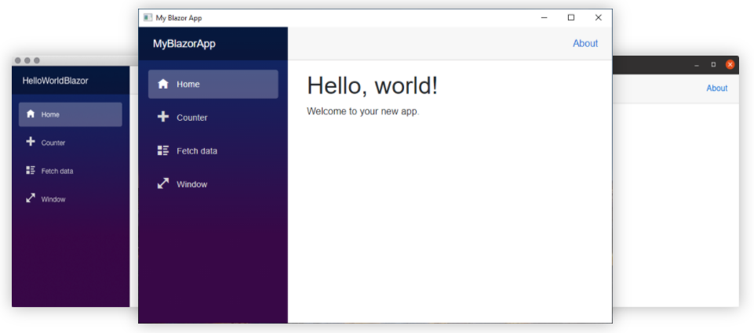
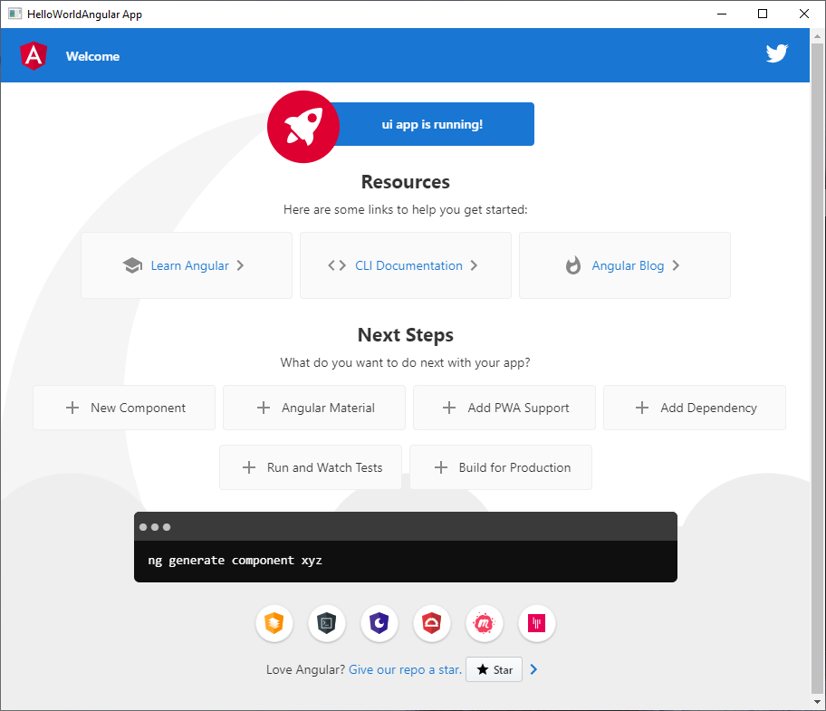
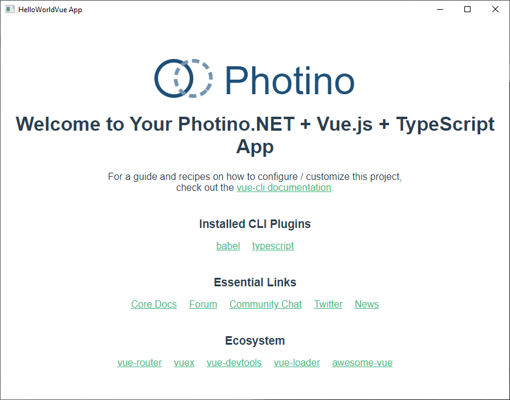
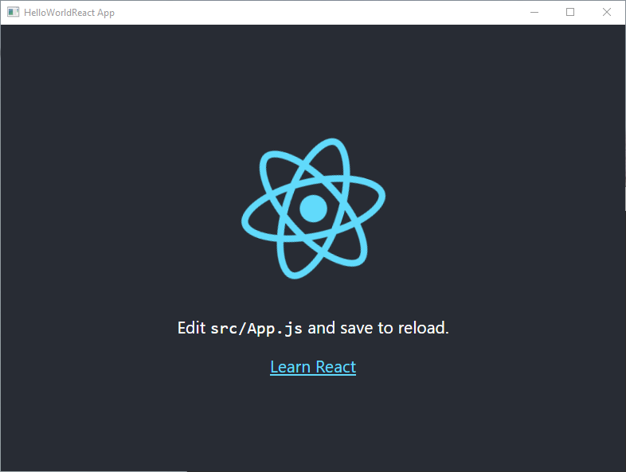

# Overview

Photino is a set of technologies for creating desktop apps with web (HTML/CSS/JavaScript) UIs. TryPhotino.io maintains the .NET build out and encourages the community to develop the Photino.Native control for use in other languages and platforms. We encourage and will support development of Photino.CPP, Photino.Rust, Photino.Go and others.

## Quick Start for .NET Developers
Photino.NET and Photino.Blazor are available as NuGet packages for .NET developers. However, we recommend installing the Photino Project Templates and using those as a starting point for learning as well as for developing new projects. 

Visual Studio users should install the [Visual Studio Photino Project Templates Extension]("https://marketplace.visualstudio.com/items?itemName=TryPhotino.PhotinoSamplesVSExtension") and search for Photino in the New Project dialog.

dotnet CLI and Visual Studio Code users should install the [Photino for .NET CLI and VS Code Project Templates NuGet Package]("https://www.nuget.org/packages/TryPhotino.VSCode.Project.Templates/"). Use `dotnet new --install TryPhotino.VSCode.Project.Templates` to install the templates, `dotnet new -l` to list installed templates, ` dotnet new photinoxxxxxx` to create new projects from the templates, and `dotnet run` to run the samples.

## The Photino Family
### Photino.Native
C++ wrapper around the OS's default browser control on Windows, Mac and Linux which creates a native OS window, places the browser control in it and exposes both the window and control to the host application. 

### Photino.NET
.NET implementation of the Photino.Native control (beginning with .NET 5). Allows .NET developers to develop .NET applications that host a Photino.Native window for hosting an HTML/CSS/JavaScript UI.

### Photino.Blazor
Extension of Photino.NET that adds Blazor functionality to the Photino.Native hosted UI.

### Photino.Samples
A collection of starter applications for .NET developers that highlights various web UI frameworks and capabilities suitable for learning Photino and for use as starting points for new projects. The installable project templates described are the preferred way to create these samples, though they can also be downloaded as .zip files.
