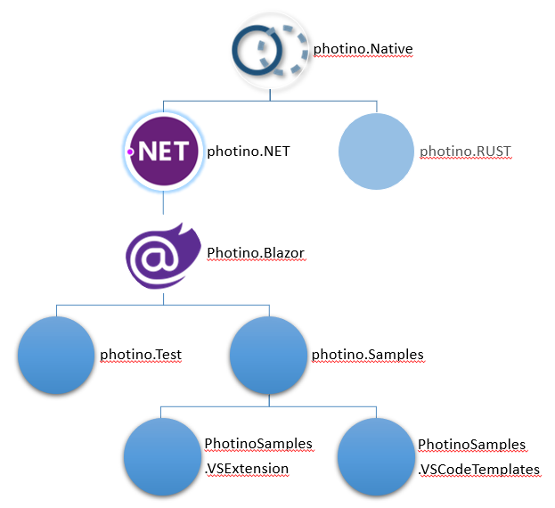

# Development Process for Contributors

## Audience
This document is for developers who would like to contribute to the development and maintenance of Photino. 

## Contributors Are Welcome!
Photino is an Open Source, community project, backed by CODE and other sponsors. The majority of bug fixes and enhancements rely on a healthy community of contributors to ensure that Photino stays relevant and viable for a long, long time.

## Branches
Photino maintains two branches for the **photino.Native, photino.NET, and photino.Blazor** repos: *master* and *debug*. The *master* branch is used only for public deployments to NuGet.org. The *debug* branch is for all development and has an integrated CI/CD pipeline (implemented in Azure DevOps) which publishes debug builds of the NuGet packages to DevOps. **Please use the *debug* branch for all branches and pull requests.** Pull requests into the *master* branch will only be accepted from the *debug* branch.

All other repos only have a *master* branch. The rule of thumb is, "If there is a *debug* branch, use it. If there is only a *master* branch, use it."

## GitHub Projects for Tracking Bugs and Enhancements
Photino maintains two projects for the **photino.Native, photino.NET, photino.Blazor, photino.Samples, PhotinoSamples.VSExtension, and PhotinoSamples.VSCodeTemplates** repos. One named *Bugs* for issues that are not enhancements, and one named *Enhancements* for everything that is not a bug. New bugs and enhancements entries are evaluated and prioritized weekly when possible.

## Pull Requests
Pull requests into the *debug* branch for projects which have one will be evaluated weekly when possible. Pull requests for photino.Native will necessitate new builds of photino.NET and photino.Blazor. Pull requests for photino.NET will necessitate a new build of photino.Blazor. These builds will create debug NuGet packages and deploy them to DevOps.

Pull requests into the *master* branch of repos without a *debug* branch will occur at least monthly.

## photino.Test
The .Test projects use the debug NuGet packages for photino.NET or photino.Blazor. They are used for testing new builds of the NuGet packages, testing new features or developing new .Sample projects.

## photino.Samples
The photino.Samples repo contains projects which use the publicly released NuGet packages for Photino.NET or photino.Blazor. They are used as the source for the project templates for Visual Studio: PhotinoSamples.VSExtension and for the dotnet CLI (with or without VS Code): PhotinoSamples.VSCodeTemplates.

## PhotinoSamples.VSExtension
The PhotinoSamples.VSExtension repo is used to produce a Visual Studio (2019 or later) VSIX extension containing project templates for all of the photino.Samples projects. See [05-Photino.VSExtension.md]( ../05-Photino.VSExtension.md ) for guidance on creating and publishing these templates.

## PhotinoSamples.VSCodeTemplates
The PhotinoSamples.VSCodeTemplates repo is used to produce a NuGet package which can be used by the dotnet CLI to install project templates for all of the photino.Samples projects. See [06-Photino.VSCodeTemplates.md]( ../06-Photino.VSCodeTemplates.md ) for guidance on creating and publishing these templates.

