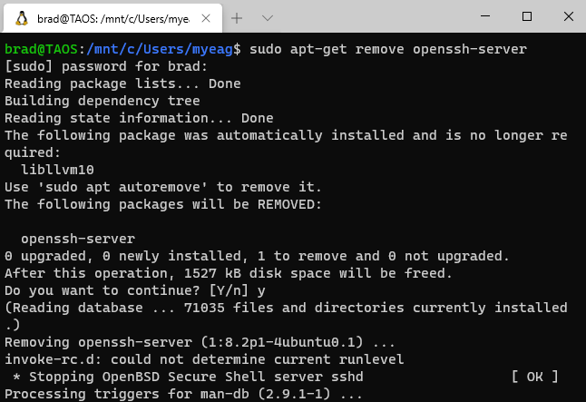
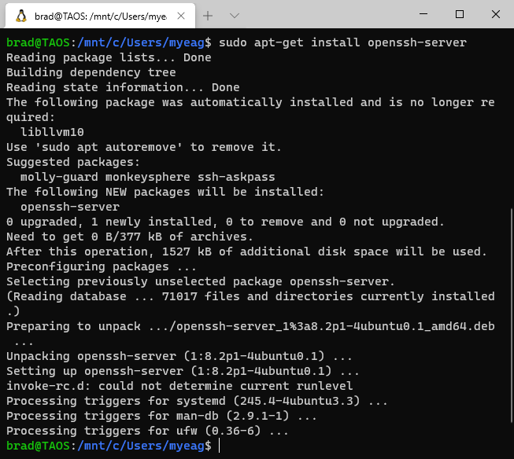
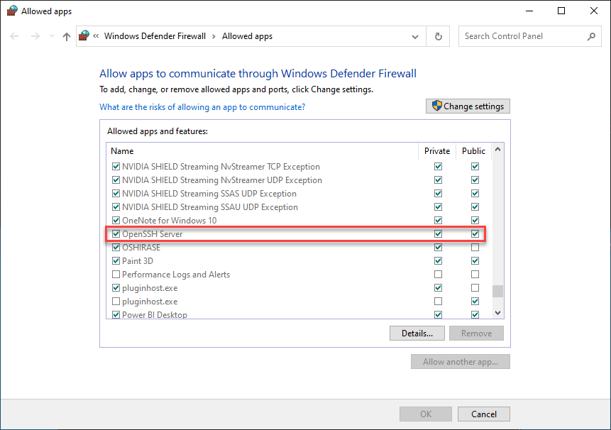
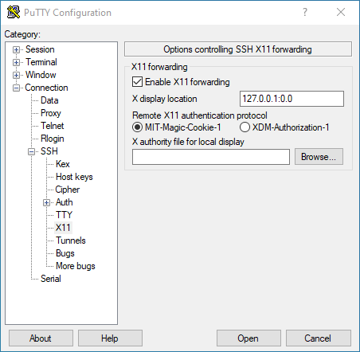
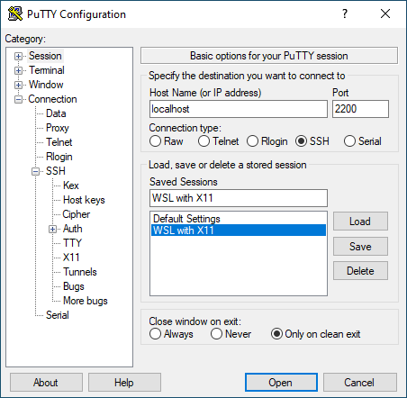

# Run Photino Apps in WSL
Yes, you can test your Photino applications in Windows Subsystem for Linux (WSL)! We've tested with WSL2 and Ubuntu 20.04. While we don't officially support running Photino Linux apps in WSL, we recognize that it is useful for testing and demos. It does require a little configuration however, because WSL does not have a graphical UI. To compensate, Linux has the X Window System, sometimes referred to as X11 or just X which provides for basic GUI functions. We've tested with [XMing]("http://www.straightrunning.com/XmingNotes/index.php") and [Putty (Unofficial)]("https://www.microsoft.com/en-us/p/putty-unofficial/9n8pdn6ks0f8?activetab=pivot:overviewtab") by Hauke Hasselberg. And in order to make this all work, you'll first need to install a 3rd component [OpenSSH Server]("https://ubuntu.com/server/docs/service-openssh"). 
  

## Configure your machine
## Install OpenSSH Server (full install) in WSL
WSL does come with a minimal package for OpenSSH Server installed, but we need the full package. So open a WSL shell (I like to use [Windows Terminal]("https://www.microsoft.com/en-us/p/windows-terminal/9n0dx20hk701?activetab=pivot:overviewtab") which can be installed from the Microsoft Store) and enter:

`sudo apt-get remove  openssh-server`

Then re-install to get the full version:

`sudo apt-get install  openssh-server`

  

Next, edit the */etc/ssh/sshd_config* file. I like to use [VS Code]("https://code.visualstudio.com/") for this, but any text editor will do. See [this article]("https://code.visualstudio.com/blogs/2019/09/03/wsl2") about running VS Code in WSL2. 

Add or change the following settings in sshd_config:
* Change - PermitRootLogin no
* Add - AllowUsers yourusername
* Change - PasswordAuthentication yes
* Add - UsePrivilegeSeparation no
* Change - ListenAddress 0.0.0.0
* Change - Port 2200

Note that some of these settings displayed warnings when I used them, but they worked.

Next, re-start the ssh service for the new settings to take effect:

`sudo service ssh --full-restart`

You will likely also have to allow the OpenSSH Server through your local firewall. For Windows 10, click start, type `Allow an app through Windows Firewall`, scroll down to OpenSSH Server and allow it on whichever networks you will access it from:

## Install XMing Server
XMing can be installed with a downloaded installer program obtained from the web page above. 

Once XMing server has been installed and run on your Windows machine, you'll see the XMing icon in your system tray. Right-click and choose 'View Log'. the last few lines of the log should look something like this: 

* winClipboardProc - DISPLAY=127.0.0.1:0.0
* winMultiWindowXMsgProc - XOpenDisplay () returned and successfully opened the display.
* winInitMultiWindowWM - XOpenDisplay () returned and successfully opened the display.
* winClipboardProc - XOpenDisplay () returned and successfully opened the display.

Next, open a WSL shell and enter: 
`export DISPLAY=127.0.0.1`

This ensures that WSL is running and sets up X11.
  

## Install Putty (Unofficial)
`Putty (Unofficial)` can be installed form the Microsoft Store. We've been told that [XMing-portablePuTTY]("http://www.straightrunning.com/XmingNotes/portable.php") works well in place of `Putty (Unofficial)`, but haven't tried it ourselves.

Finally, run Putty (Unofficial). Set the Host Name (or IP address) to `localhost` or `127.0.0.1` and set the Port to `2200`. Under the Connection category open the SSH sub-category, click on X11, check Enable X11 forwarding and set X display location to `127.0.0.1`

On the Session category (the home screen), enter a name under Saved Sessions and click the Save button. Next time you run Putty (Unofficial), you can load these settings to recall your configuration.

  
Our configuration was created from [this article]("https://virtualizationreview.com/articles/2017/02/08/graphical-programs-on-windows-subsystem-on-linux.aspx") Many thanks to Tom Fenton, the author.